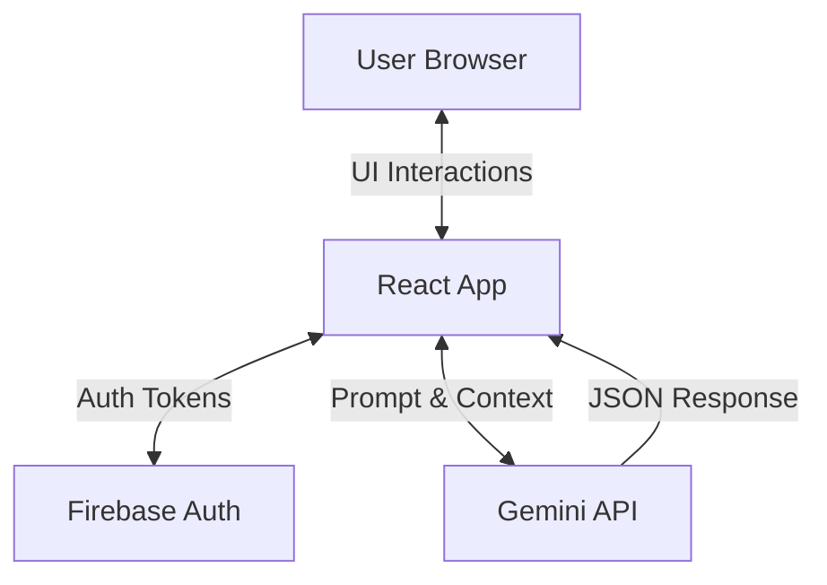

# 📘 SolveTree Technical Documentation

## 1. Project Overview
**SolveTree** is a client-side React application designed to help users make complex decisions and plans using Generative AI. It leverages Google's Gemini 2.5 Flash model to analyze user inputs and generate structured data (decision trees, strategic plans) or interactive chat sessions.

## 2. Technology Stack

### Frontend Core
*   **Framework:** React 19
*   **Build Tool:** Vite 6.0 (Fast HMR and bundling)
*   **Language:** TypeScript 5.0 (Strict type safety)
*   **Routing:** React Router DOM (SPA routing)

### UI & Styling
*   **Styling:** Tailwind CSS 3.0 (Utility-first styling)
*   **Icons:** Lucide React (Lightweight, consistent icons)
*   **Visualization:** D3.js (Complex tree graph rendering)

### Backend & Services
*   **AI Engine:** Google Gemini 2.5 Flash (via `@google/genai` SDK)
*   **Authentication:** Firebase Auth (Google Sign-In, Email/Password)
*   **Hosting:** Render (Static Site Hosting)

---

## 3. Architecture

The application follows a **Serverless / Client-Side** architecture. There is no dedicated backend server (Node/Python). The React frontend communicates directly with third-party APIs.



---

## 4. Core Features & Logic

### A. Decision Tree Engine (`DecisionTree.tsx`)
*   **Logic:** Takes a user's vague problem statement.
*   **AI Process:** Sends a prompt to Gemini asking for a hierarchical breakdown.
*   **Output:** Returns a recursive JSON structure (`TreeNode`) representing the problem, choices, and outcomes.
*   **Visualization:** Uses `D3TreeGraph.tsx` to render this JSON as an interactive node-link diagram.

### B. Binary Solver (`DecisionTree.tsx` - Interactive Mode)
*   **Logic:** A stateful chat session that acts like a "20 Questions" game.
*   **AI Process:** Uses `ai.chats.create()` to maintain context.
*   **Prompt Engineering:** The system instruction forces the AI to ask *only* YES/NO questions until a conclusion is reached.
*   **State Management:** Tracks the history of Q&A to display breadcrumbs.

### C. Strategic Planner (`Planner.tsx`)
*   **Logic:** Generates a chronological execution plan for a goal.
*   **Categorization:** Users select a category (Travel, Business, etc.) which changes the "Persona" of the AI (e.g., "Travel Agent" vs "Startup Consultant").
*   **Structured Output:** Gemini is forced to return a specific JSON schema containing:
    *   `phases`: Array of time-bound phases.
    *   `tasks`: Specific actionable items with priority.
    *   `costEstimate` & `location`: (New) Specific fields for travel/event plans.

---

## 5. API Integration Details

### Google Gemini API
We use the `gemini-2.5-flash` model for its speed and low latency.

**Key Functions (`services/gemini.ts`):**

1.  **`generateDecisionTree(situation)`**
    *   **Input:** User string.
    *   **System Prompt:** "You are an expert decision scientist... Return a single JSON object..."
    *   **Output:** `TreeNode` JSON.

2.  **`generateStrategicPlan(goal, category)`**
    *   **Input:** Goal string, Category string.
    *   **Dynamic Prompting:** The system instruction changes based on `category`.
        *   *Travel:* Asks for logistics and costs.
        *   *Business:* Asks for MVP and market research.
    *   **Output:** `StrategicPlan` JSON.

### Firebase Configuration
Firebase is initialized in `firebase.ts` using Environment Variables.
*   **Auth Domain:** `thesolvetree.firebaseapp.com`
*   **Security:** API Keys are public-safe (restricted by domain in Google Cloud Console).

---

## 6. Environment Variables

To run this project locally or deploy it, the following keys are required in `.env.local` (local) or Render Environment Settings (production).

| Variable | Description |
| :--- | :--- |
| `GEMINI_API_KEY` | Google AI Studio API Key for Gemini models. |
| `VITE_FIREBASE_API_KEY` | Firebase Project API Key. |
| `VITE_FIREBASE_AUTH_DOMAIN` | Firebase Auth Domain. |
| `VITE_FIREBASE_PROJECT_ID` | Firebase Project ID. |
| `VITE_FIREBASE_STORAGE_BUCKET` | Firebase Storage Bucket URL. |
| `VITE_FIREBASE_MESSAGING_SENDER_ID` | Firebase Messaging ID. |
| `VITE_FIREBASE_APP_ID` | Firebase App ID. |
| `VITE_FIREBASE_MEASUREMENT_ID` | Google Analytics ID. |

---

## 7. Folder Structure

```
/src
  /components    # UI Components (Home, Planner, DecisionTree)
  /contexts      # React Contexts (AuthContext)
  /services      # API Logic (gemini.ts)
  /types         # TypeScript Interfaces (types.ts)
  App.tsx        # Main Router
  firebase.ts    # Firebase Initialization
  main.tsx       # Entry Point
```

## 8. Future Roadmap & Monetization

*   **Database Integration:** Connect Firestore to save user plans.
*   **Usage Limits:** Implement a credit system (e.g., 5 free plans/day) to prevent API abuse.
*   **Pro Tier:** Stripe integration for premium features (PDF export, unlimited history).
